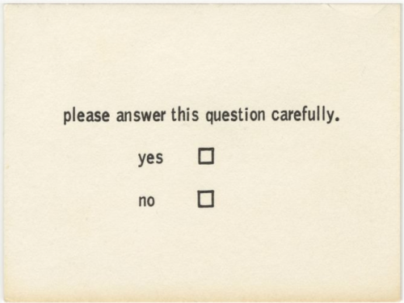

# A manual of you for your computer

[Benjamin Patterson. Questionnaire from Flux Year Box 2. c.1968]

### What?
--------------
This script generate a pdf file with a set of instructions detailing your daily computer activity in a series of steps. A manual of yourself so your computer can start figuring out how to understand you.

### Create your own Manual
--------------
Instructions for OSX:

[1] Clone or download this repo:
  - `git clone https://github.com/cvalenzuela/usermanual.git`
  - Install weasyprint: `pip install weasyprint`

[2] Install [weasyprint](http://weasyprint.readthedocs.io/en/latest/) dependencies:
  - `brew install python cairo pango gdk-pixbuf libxml2 libxslt libffi`
  - If you don't have brew, install it first: `/usr/bin/ruby -e "$(curl -fsSL https://raw.githubusercontent.com/Homebrew/install/master/install)"`

[3] This project uses [ulogme](https://github.com/karpathy/ulogme) to load your data. Install [ulogme](https://github.com/karpathy/ulogme) and keep it running as long as you want. As detailed in its repo:
  - [Download ulogme](https://github.com/karpathy/ulogme/archive/master.zip) and save it in the same folder.
  - Unzip it, cd inside the folder and run `./ulogme.sh`
  - This will create a folder `logs/` with your keystroke frequency and your active windows activity. It will keep running until you end the process with: `ctrl+c`
  - If you have any issues with this, take a look at the [ulogme repo](https://github.com/karpathy/ulogme)

[4] Whenever you want to create your personal manual:
  - Stop ulogme
  - Since ulogme will create a new file everytime it is run, go inside the `logs/` folder, and change the name of the `keyfreq_1488801600.txt` file to `keyfreq.txt` and `window_1488801600.txt` to `windows.txt`. Were the number `1488801600` will be different each time.
  - Run `python createmanual.py`.

### Inspiration
--------------
- [Flux Year Box](https://www.moma.org/interactives/exhibitions/2011/fluxus_editions/category_works/fluxyearbox2/)
- [Grapefruit - Yoko Ono](https://en.wikipedia.org/wiki/Grapefruit_(book))
- [“This is a portrait of Iris Clert if I say so” - Robert Rauchenberg](http://www.rauschenbergfoundation.org/art/artwork/portrait-iris-clert-if-i-say-so)
- IRS Tax return
- Canon Rebel T3i Manual

### Demo
--------------
[Demo](demo/userusermanual.pdf)
